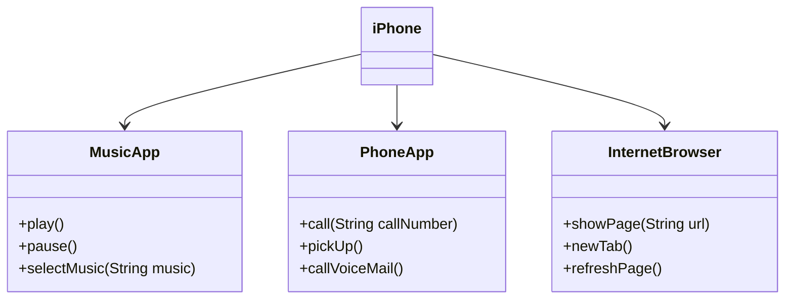

# [DIO](www.dio.me) - Trilha Java Básico

## Autores

- [Caio Bukvar](https://github.com/caiobukvar)

## POO - Desafio

### Modelagem e Diagramação de um Componente iPhone

Neste desafio, você será responsável por modelar e diagramar a representação UML do componente iPhone, abrangendo suas funcionalidades como Reprodutor Musical, Aparelho Telefônico e Navegador na Internet.

#### Contexto

Com base no vídeo de lançamento do iPhone de 2007 (link abaixo), você deve elaborar a diagramação das classes e interfaces utilizando uma ferramenta UML de sua preferência. Em seguida, implemente as classes e interfaces no formato de arquivos `.java`.

[Lançamento iPhone 2007](https://www.youtube.com/watch?v=9ou608QQRq8)

- Minutos relevantes: 00:15 até 00:55

#### Funcionalidades a Modelar

1. **Reprodutor Musical**
   - Métodos: `play()`, `pause()`, `selectMusic(String music)`
2. **Aparelho Telefônico**
   - Métodos: `call(String numberToCall)`, `pickUp()`, `callVoiceMail()`
3. **Navegador na Internet**
   - Métodos: `showPage(String url)`, `newTab()`, `refreshPage()`

### Diagrama UML (Mermaid)



```bash
https://github.com/glysns/trilha-java-basico/desafios/poo/README.md
```
